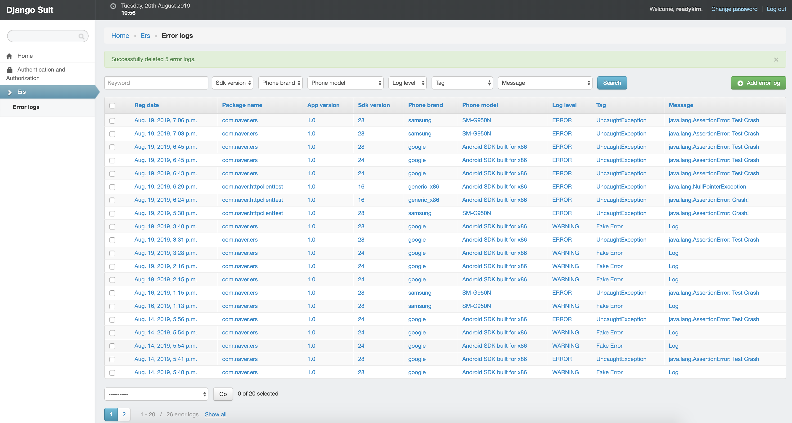

Error Reporting Server
=====
Error Reporting Server의 역할은 다음과 같습니다.
1. Client에게 Server의 시간을 알려준다.
2. Client로부터 전송 받은 Error Log를 저장한다.

Example
=====

Environment
=====
서버를 구동하기 위해 갖추어야 하는 python 환경은 다음과 같습니다.  
* python 3.x
* django 2.x
* suit 2.x